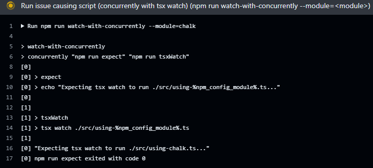

# `tsx watch` + `concurrently` + `Windows` issue repro

## Reproducing the issue

### If you have a Windows machine

*(In these steps `<module>` is any one of the following `chalk`, `prom-client`, `swagger-stats`, `googleapis`)*

1. Clone the repository.
2. Run `npm install tsx concurrently` to install dependencies.
3. Run `npm install <module>`.
4. Run `npm run tsxWatch --module=<module>`, then `npm run concurrently-without-watch --module=<module>`, then `npm run watch-with-concurrently-hack --module=<module>`. You should see **Everything is fine!** in the console.
5. Run `npm run watch-with-concurrently --module=<module>` and `tsx watch` will not run, and you will not see **Everything is fine!**.

### If you don't have a Windows machine

1. Fork this repository, then go to the **Actions** tab in your fork.
2. Click on the action **Scripts with no issue** in the left pane.
3. Click on **Run workflow** then **Run workflow**.
4. After about a minute you should see all the jobs ended with success, because each run script had **Everything is fine!** in its output.
5. Gob back and click on **Reproduce tsx watch issue** action in the left pane of the **Actions** tab.
6. Click on **Run workflow** then **Run workflow**.
7. Inspect the pending run, and specifically the **Run issue causing script** step, which is running the script `concurrently "npm run expect" "npm run tsxWatch"`, and you should see that `npm run expect` ran successfully (`"Expecting tsx watch to run ./src/using-chalk.ts..."`), but `npm run tsxWatch` doesn't run at all, and you will not see **Everything is fine!**, as can be seen in the following screenshot.

## Explanation

1. `tsxWatch` script runs because `tsx watch` is running without `concurrently`.
2. `concurrently-without-watch` runs because we removed `watch` out of the `tsx` script.
3. `watch-with-concurrently-hack` runs due to a [workaround](https://github.com/vercel/turbo/issues/7834#issuecomment-2033172950) found by the [turbo](https://github.com/vercel/turbo) team.

## Notes

1. `tsx watch` hangs on `Windows` even without using `concurrently` as can be seen on that [previously linked issue](https://github.com/vercel/turbo/issues/7834), which provides more evidence that this issue is not a [concurrenlty](https://www.npmjs.com/package/concurrently) or [turbo](https://github.com/vercel/turbo) issue but rather a [tsx](https://www.npmjs.com/package/tsx) one.
2. The workaround proposed by the turbo team and used on the `watch-with-concurrently-hack` script cannot be considered a real solution because `npm` scripts are used on different platforms but `< NUL` is a windows thing.
